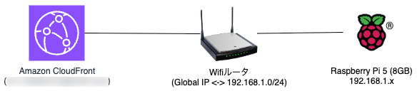

Raspberry PiにMoodleをインストール
===

## 最初に

私は、この手順でRaspberry Pi 5 (8GB)にMoodleをインストールし、またAmazon CloudFrontを使用して外部からアクセスできるようにしています。



ここに記述した手順をRaspberry Piのコマンドラインで実行する場合は、先にansibleをインストールしてください。

```
sudo apt install ansible -y
```

### 注意事項

ドメイン名の例として `example.com` としています。適宜使用するドメイン名に置換してください。

## インストールするホストを定義

- playbook.ymlと同じディレクトリのhostsファイルを必要に応じて修正してください。

```
localhost
```

## ansible-playbookコマンドを実行して必要なパッケージをインストール

```
ansible-playbook -i hosts playbook.yml
```

## apache2のSSLモジュールを有効にする

```
sudo a2enmod ssl
```

## 証明書の作成

- 証明書のドメイン名は、下のように `*` を使ったワイルドカードにすると便利です。

```
sudo certbot certonly --manual -d '*.example.com' --preferred-challenges dns
```

## apache2の設定ファイルの作成

- 000-default-ssl.confファイルをコピーコマンドで作成します。

```
sudo cp /etc/apache2/sites-available/default-ssl.conf /etc/apache2/sites-available/000-default-ssl.conf
```

- コピーで作成した、/etc/apache2/sites-available/000-default-ssl.confファイルを次のように一部修正

```
SSLCertificateFile /etc/letsencrypt/live/example.com/fullchain.pem
SSLCertificateKeyFile /etc/letsencrypt/live/example.com/privkey.pem
```

- 設定ファイルを有効化

```
sudo a2ensite 000-default-ssl.conf
```

## Moodleをクローン

gitコマンドを使ってMoodleをダウンロードします。

```
cd /opt
sudo git clone git://git.moodle.org/moodle.git
```

## インストールするMoodleバージョンを取得

ここでは、Moodle 4.4 の安定版を指定しています。

```
sudo git branch --track MOODLE_404_STABLE origin/MOODLE_404_STABLE
sudo git checkout MOODLE_404_STABLE
```

## apache2の公開用のディレクトリにコピー

```
sudo cp -R /opt/moodle /var/www/html/
sudo mkdir /var/moodledata
sudo chown -R www-data /var/moodledata
sudo chmod -R 777 /var/moodledata
sudo chmod -R 0755 /var/www/html/moodle
```

## データベースの設定

- データベースのパスワード設定 (PASSWORDを置換してください)

```
sudo mysqladmin password 'PASSWORD'
```

## moodle データベースを作成

```
sudo mysql -u root -p
```

```
CREATE DATABASE moodle DEFAULT CHARACTER SET utf8mb4 COLLATE utf8mb4_unicode_ci;
```

`exit` でデータベースセッションから抜けます。

## Moodle の構成ファイル　(config.php) の設定

```
sudo php /var/www/html/moodle/admin/cli/install.php
```

- デフォルト値以外の設定を記述します。

```
== Data directories permission ==
type value, press Enter to use default value (2777)
: 00777
```

```
== Web address ==
type value
: https://<YOUR Domain Name>
```

```
== Data directory ==
type value, press Enter to use default value (/var/www/html/moodledata)
: /var/moodledata
```

```
== Database password ==
type value
: <MySQL の root ユーザの PASSWORD>
```

```
== Full site name ==
type value
: <サイト名>
```

```
== Short name for site (eg single word) ==
type value
: <サイト名略称>
```

```
== New admin user password ==
type value
: <Moodle 管理者 (admin) のパスワード>
```

```
Have you read these conditions and understood them?
type y (means yes) or n (means no)
: y
```

- `/var/www/html/moodle/config.php`のモードを変更します。

```
sudo chmod 664 /var/www/html/moodle/config.php
```

## apache2を再起動

```
sudo systemctl restart apache2
```

## 参考URL

- [Moodle 4.4をAmazon EC2にインストールする](https://developer.mamezou-tech.com/blogs/2024/05/07/installing-moodle-on-aws/)
